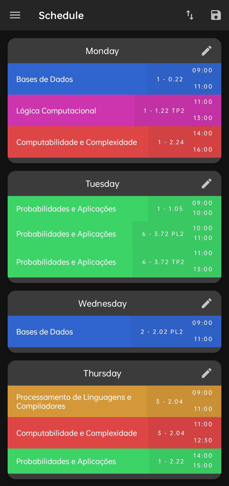

# SchoolTime  

**SchoolTime** is an Android app for students who need a quick, easy way to plan their day. It combines your schedule and the weather so you can see everything at a glance and know exactly when to wake up in the morning.  

  

## Features  

### 1. **Weather Integration**  
- See the day’s weather alongside your schedule.  

### 2. **Uminho-Shift-Chooser Integration**  
- Import your university schedule via [UMinho-Shift-Chooser](https://github.com/Darguima/UMinho-Shift-Chooser).  

### 3. **Handy Widget**  
- See upcoming activities without opening the app.  

---

## Technologies Used  
- **Language**: Kotlin  
- **Platform**: Android  

---

## The Journey  
SchoolTime started as a way to simplify my day planning and know when to wake up. Later, I added UMinho integration for easy university scheduling.  

This was my first Android app, and learning Kotlin made it a fun and rewarding experience.  

---

## How to Run  
1. Download the APK from the repo.  
2. Install it on your phone.  
3. Start planning your day!  

---

## Acknowledgments  
- **UMinho-Shift-Chooser** for making shift management easier.  
- Kotlin and Android for being awesome to work with.  

---

## License  
Made for fun and learning. Feel free to try it out and improve it!  